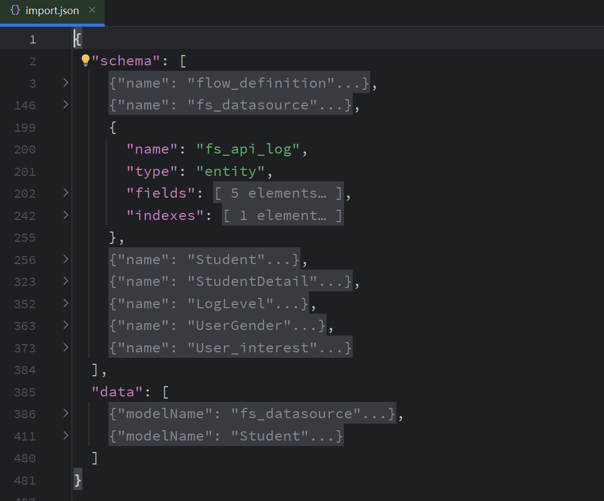
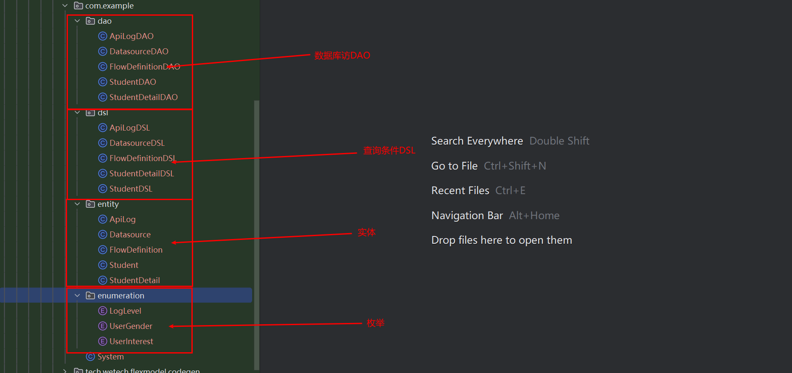
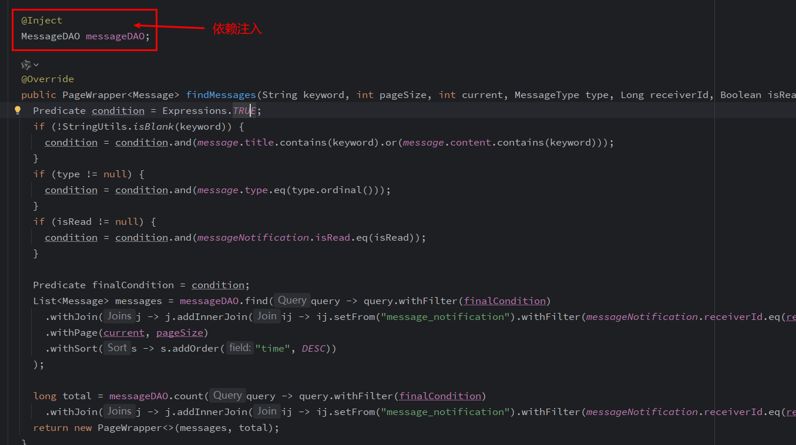

# flexmodel-maven-plugin

Flexmodel的maven插件，当作为ORM框架使用时，可通过json描述文件生成实体类、DAO等代码，减少开发人员开发成本。

1. 创建json描述文件 import.json
   

2. 引入插件

```xml
<plugin>
    <groupId>tech.wetech.flexmodel</groupId>
    <artifactId>flexmodel-maven-plugin</artifactId>
    <version>LATEST</version>
    <executions>
        <execution>
            <phase>generate-sources</phase>
            <goals>
                <goal>generate</goal>
            </goals>
        </execution>
    </executions>
    <configuration>
        <generator>
            <schema>
                <!--schema 名称-->
                <name>system</name>
                <!--json 描述文件路径-->
                <import-script>src/main/resources/import.json</import-script>
            </schema>
            <target>
                <!-- 生成的包名 -->
                <packageName>tech.wetech.flexmodel.codegen</packageName>
                <!-- 根据模型名称替换的字符串，可替换表前缀，支持正则表达式 -->
                <replaceString>^fs_</replaceString>
            </target>
        </generator>
    </configuration>
</plugin>
```

3. 运行mvn clean compile即可生成代码



4. 可直接通过CDI依赖注入使用


