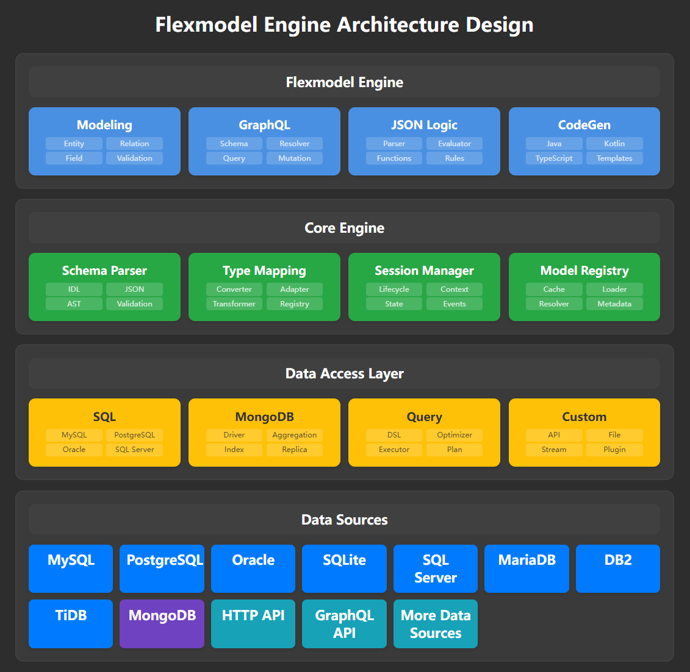

# API 介绍

Flexmodel 提供了完整的 REST API 和 GraphQL API，用于管理数据模型、数据记录和系统配置。



## 主要功能

- **数据建模**: 创建和管理实体、枚举、本地查询等数据模型
- **数据操作**: 增删改查数据记录，支持复杂查询条件
- **数据源管理**: 配置和管理多种数据库连接
- **API 管理**: 自定义 API 定义和管理
- **GraphQL**: 自动生成的 GraphQL API
- **系统管理**: 用户认证、日志记录、系统设置等

## API 基础

### 认证

大部分 API 需要认证，请在请求头中包含 JWT Token：

```
Authorization: Bearer <your-jwt-token>
```

### 基础路径

- REST API: `/api/v1`
- GraphQL: `/graphql`

### 响应格式

所有 API 响应都使用 JSON 格式，当响应成功时返回格式就是数据本身，当响应失败时返回格式如下：

```json
{
  "code": -1,
  "message": "error",
  "errors": [
    {
      "foo": "bar"
    }
  ]
}
```

## 快速开始

1. **配置数据源**: 使用数据源管理 API 配置数据库连接
2. **创建模型**: 使用模型管理 API 定义数据模型
3. **操作数据**: 使用记录管理 API 进行数据增删改查
4. **自定义 API**: 使用 API 定义功能创建自定义接口

## 相关文档

- [模型 Schema](./model-schema.md) - 数据模型定义规范
- [查询条件](./condition.md) - 查询条件语法说明
- [REST API](./rest-api.md) - REST API 详细文档
- [GraphQL API](./graphql-api.md) - GraphQL API 文档
