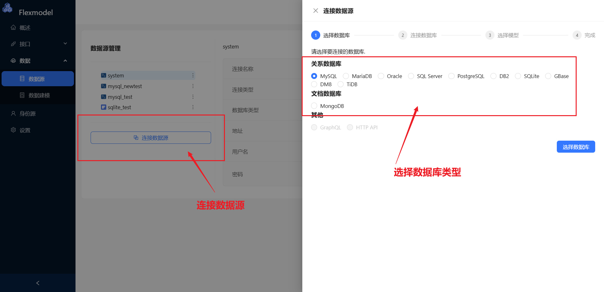
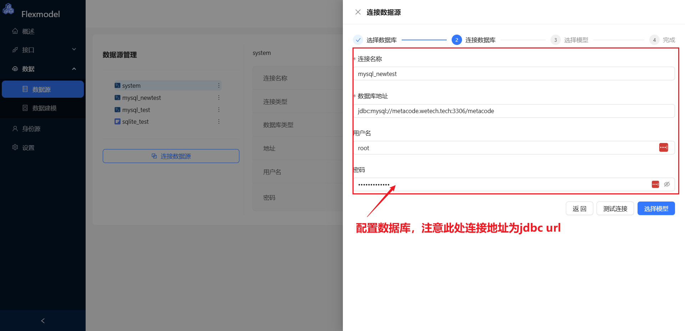
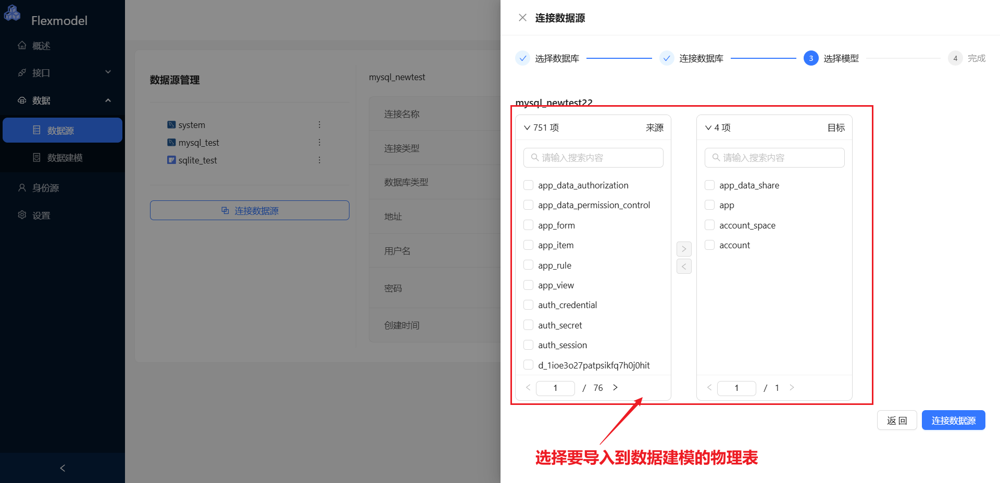
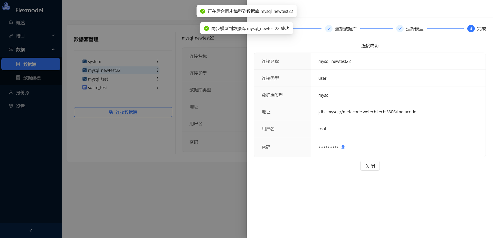
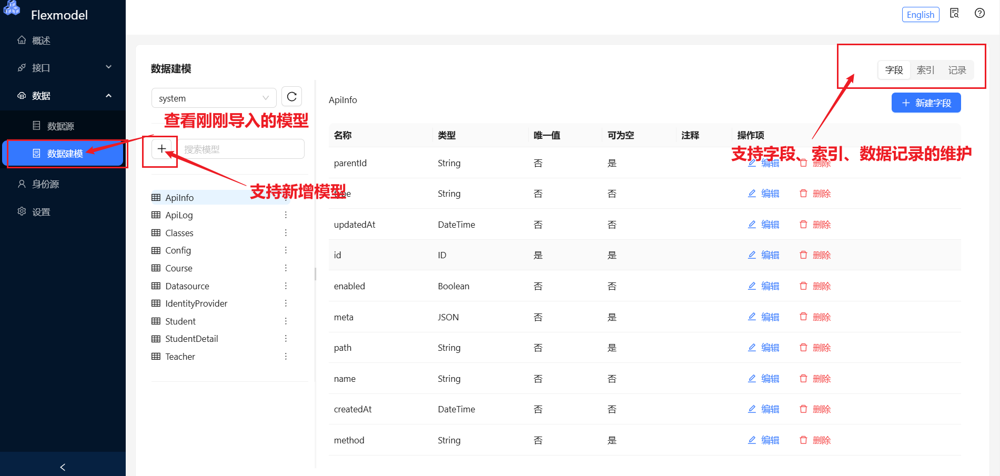
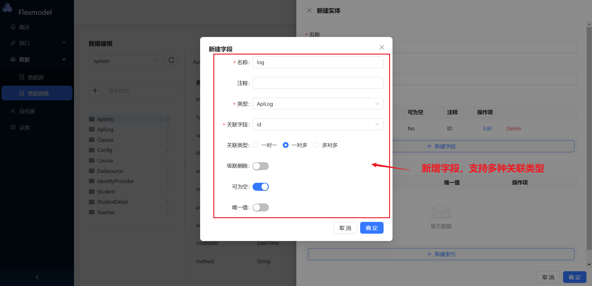
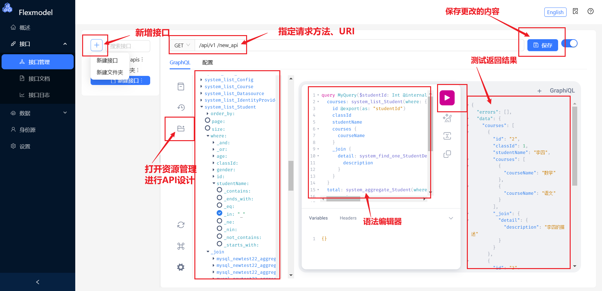
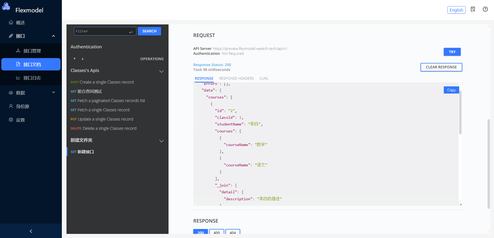

# 新手指引

上手前，您需要学会GraphQL，并了解如何使用GraphQL。

关于GraphQL的使用请查看此教程： [GraphQL 入门](https://graphql.cn/learn/)

主要包括以下步骤：

1. 配置数据源
  1. 连接数据源，选择数据表
     
  2. 配置数据库地址
     
  3. 选择要导入到建模的物理表
     
  4. 完成数据源连接
     

2. 数据建模
  1. 模型管理，支持常用的模型操作
     
  2. 新增实体
     

3. 设计API
   

4. 使用API
   
